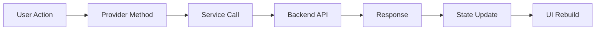

# Flutter App (slam-app)

## Überblick

Die SLaM-App ist eine plattformübergreifende Mobile- und Web-Anwendung, die mit **Flutter 3.27+** entwickelt wurde. Sie bietet Schülern ein adaptives, gamifiziertes Lernerlebnis mit KI-gestützten Fragen, Echtzeit-Feedback und personalisierten Lernplänen.

## Technologie-Stack

- **Framework**: Flutter 3.27+ / Dart 3.6+
- **State Management**: Riverpod 2.6+ mit Code-Generierung
- **Design System**: Material 3
- **Schriftart**: Google Sans Flex
- **Backend-Kommunikation**: Dio (HTTP Client)
- **Lokale Persistenz**: Hive + SharedPreferences
- **Cloud-Persistenz**: Cloud Firestore
- **Authentifizierung**: Firebase Auth
- **Code-Generierung**: build_runner, freezed, json_serializable

## Architektur

### Clean Architecture

Die App folgt einer strikten **Clean Architecture** mit drei Schichten:

```
┌─────────────────────────────────────┐
│   Presentation Layer (UI + State)  │
│   - Screens, Widgets, Providers    │
└─────────────────┬───────────────────┘
                  │
┌─────────────────▼───────────────────┐
│      Domain Layer (Business Logic)  │
│      - Models, Entities             │
└─────────────────┬───────────────────┘
                  │
┌─────────────────▼───────────────────┐
│   Data Layer (Repositories, APIs)   │
│   - Services, Datasources           │
└─────────────────────────────────────┘
```

### Ordnerstruktur

```
lib/
├── main.dart                    # Entry Point
├── firebase_options.dart        # Auto-generiert
├── app/
│   ├── app.dart                 # SLAMApp (MaterialApp.router)
│   ├── routes.dart              # GoRouter + Auth Redirect
│   └── theme.dart               # Material 3 Themes
├── core/
│   ├── app_initializer.dart     # Firebase, Hive, Services Init
│   ├── constants/               # API Endpoints, Firebase Collections
│   ├── data/
│   │   ├── datasources/         # local_datasource, remote_datasource
│   │   ├── models/result.dart   # Result<T,E> Functional Error Type
│   │   └── repositories/        # base, lernplan, settings
│   ├── models/                  # Freezed Domain Models
│   │   ├── question.dart
│   │   ├── user_stats.dart
│   │   ├── lernplan.dart
│   │   └── saved_content.dart
│   ├── services/
│   │   ├── ai_service.dart      # Backend API Wrapper
│   │   ├── auth_service.dart    # Firebase Auth
│   │   └── firestore_service.dart # Firestore CRUD
│   └── utils/
│       ├── logger.dart          # Structured Logging
│       ├── error_handler.dart   # Global Error Handler
│       └── security_utils.dart  # Input Sanitization
├── features/
│   ├── auth/                    # Login, Register, Email Verification
│   ├── home/                    # Main Navigation (3 Tabs)
│   ├── live_feed/               # Adaptive Question Feed
│   ├── learning_plan/           # Lernplan Topic Picker
│   ├── question_session/        # Step-by-Step Question Answering
│   ├── apps/                    # AppsHub, GeoGebra, KI-Labor
│   ├── gamification/            # XP, Coins, Streaks, Shop
│   └── settings/                # Theme, Education Level, Debug Panel
└── shared/widgets/              # Reusable Widgets
```

### Feature-First Organisation

Jedes Feature ist ein isoliertes Modul mit eigener Ordnerstruktur:

```
features/live_feed/
├── data/
│   ├── models/              # Feature-spezifische Models
│   └── repositories/        # Feature-spezifische Repositories
├── domain/
│   └── entities/            # Business Entities
└── presentation/
    ├── providers/           # Riverpod Providers
    ├── screens/             # Full-Screen Views
    └── widgets/             # Feature-spezifische Widgets
```

## State Management: Riverpod 2.6+

### Warum Riverpod?

- **Compile-Time Safety**: Fehler werden zur Compile-Zeit erkannt
- **Testbarkeit**: Provider sind einfach zu mocken
- **Performance**: Automatische Optimierung durch Dependency Tracking
- **Code-Generierung**: Weniger Boilerplate durch `@riverpod`

### Provider-Typen

**Service Provider** (Singleton):
```dart
@riverpod
AIService aiService(Ref ref) {
  final dio = Dio(BaseOptions(baseUrl: ApiEndpoints.baseUrl));
  return AIService(dio);
}
```

**Stream Provider** (Reactive):
```dart
@riverpod
Stream<User?> authStateChanges(Ref ref) {
  final authService = ref.watch(authServiceProvider);
  return authService.authStateChanges;
}
```

**Notifier Provider** (Mutable State):
```dart
@riverpod
class LiveFeedQueue extends _$LiveFeedQueue {
  @override
  List<Question> build() => [];

  void addQuestions(List<Question> questions) {
    state = [...state, ...questions];
  }

  Question? getNext() {
    if (state.isEmpty) return null;
    final question = state.first;
    state = state.sublist(1);
    return question;
  }
}
```

### Dependency Injection

Riverpod fungiert als DI-Container:

```dart
// Service wird automatisch injiziert
final aiService = ref.watch(aiServiceProvider);

// Abhängigkeiten werden automatisch aufgelöst
@riverpod
Future<QuestionSession> generateQuestions(Ref ref, ...) async {
  final aiService = ref.watch(aiServiceProvider);
  final user = ref.watch(currentUserProvider);
  
  return aiService.generateQuestions(userId: user!.uid, ...);
}
```

### Zero-Warning Policy

**Problem**: Riverpod 2.x → 3.0 Migration führte zu 31 Deprecation Warnings.

**Lösung**: Alle `XxxRef` Typen durch generisches `Ref` ersetzt.

**Vorher**:
```dart
@riverpod
AIService aiService(AiServiceRef ref) { ... }
```

**Nachher**:
```dart
@riverpod
AIService aiService(Ref ref) { ... }
```

**Ergebnis**: 0 Deprecation Warnings, 100% moderne API-Nutzung.

## Datenfluss

### Unidirectional Data Flow



**Beispiel: Frage beantworten**

```dart
// 1. User Action (UI)
ElevatedButton(
  onPressed: () => ref.read(questionSessionProvider.notifier).submitAnswer(answer),
  child: Text('Antworten'),
)

// 2. Provider Method
@riverpod
class QuestionSession extends _$QuestionSession {
  Future<void> submitAnswer(String answer) async {
    state = state.copyWith(isLoading: true);
    
    // 3. Service Call
    final result = await ref.read(aiServiceProvider).evaluateAnswer(...);
    
    // 4. State Update
    state = state.copyWith(
      isLoading: false,
      currentResult: result,
    );
  }
}

// 5. UI Rebuild (automatisch durch Riverpod)
```

## Offline-First Caching

### 4-Layer-Architektur

```
┌─────────────────────────────────────┐
│  L1: In-Memory (Riverpod State)    │  ← Schnellster Zugriff
├─────────────────────────────────────┤
│  L2: SharedPreferences              │  ← Lokale Queue-Fallback
├─────────────────────────────────────┤
│  L3: Hive Boxes                     │  ← User Profile, Settings
├─────────────────────────────────────┤
│  L4: Cloud Firestore                │  ← Primary Cache, Sync
└─────────────────────────────────────┘
```

**Implementierung**:

```dart
class LiveFeedQueue {
  // L1: In-Memory
  List<Question> _questions = [];

  Future<void> loadQuestions() async {
    // L4: Firestore Cache
    final cached = await _firestoreService.getQuestionCache(userId);
    if (cached != null && !cached.isExpired) {
      _questions = cached.questions;
      return;
    }

    // L2: SharedPreferences Fallback
    final local = await _prefs.getString('question_queue');
    if (local != null) {
      _questions = jsonDecode(local);
      return;
    }

    // Keine Cache-Treffer → Backend-Call
    await _fetchFromBackend();
  }

  Future<void> saveToCache() async {
    // L2: SharedPreferences
    await _prefs.setString('question_queue', jsonEncode(_questions));
    
    // L4: Firestore
    await _firestoreService.saveQuestionCache(userId, _questions);
  }
}
```

**Vorteile**:
- **Instant Load**: App startet mit gecachten Fragen
- **Offline-Fähig**: Fragen können offline beantwortet werden
- **Sync**: Automatische Synchronisation bei Netzwerk-Verfügbarkeit

## Error Handling

### Elegante Fehlerbehandlung

**Problem**: Verschachtelte if-else-Blöcke in `_handleDioException()` führten zu hoher Komplexität.

**Lösung**: Flache Struktur mit Early Returns und dediziertem Error-Extractor.

**Implementierung** (`ai_service.dart`):

```dart
AIException _handleDioException(DioException e) {
  // Response errors (4xx, 5xx)
  if (e.response != null) {
    return AIException(
      statusCode: e.response!.statusCode,
      message: _extractErrorMessage(e.response!.data),
    );
  }

  // Timeout errors
  if (e.type == DioExceptionType.connectionTimeout || 
      e.type == DioExceptionType.receiveTimeout) {
    return AIException(
      statusCode: 408,
      message: e.type == DioExceptionType.connectionTimeout
          ? 'Verbindungszeitüberschreitung. Bitte versuche es erneut.'
          : 'Antwort-Zeitüberschreitung. Bitte versuche es erneut.',
    );
  }

  // Network errors
  return AIException(
    statusCode: 0,
    message: 'Netzwerkfehler: ${e.message}',
  );
}

String _extractErrorMessage(dynamic data) {
  if (data is! Map<String, dynamic>) return 'API Error';

  final error = data['error'];
  final message = data['message'];

  if (error is String && error.isNotEmpty) {
    if (message is String && message.isNotEmpty && message != error) {
      return '$error\n$message';
    }
    return error;
  }

  if (message is String && message.isNotEmpty) {
    return message;
  }

  return 'API Error';
}
```

**Vorteile**:
- **Lesbarkeit**: Klare Struktur, keine Verschachtelung
- **Wartbarkeit**: Einfach erweiterbar
- **Testbarkeit**: Jeder Pfad ist isoliert testbar
- **Komplexität**: Reduziert von 8 → 3 (Cyclomatic Complexity)

### Global Error Handler

```dart
class ErrorHandler {
  static void handleError(Object error, StackTrace stackTrace) {
    Logger.error(
      'Unhandled error',
      tag: 'ErrorHandler',
      error: error,
      stackTrace: stackTrace,
    );

    // Sentry/Crashlytics Integration hier
  }
}

// In main.dart
void main() {
  FlutterError.onError = (details) {
    ErrorHandler.handleError(details.exception, details.stack!);
  };

  runApp(const SLAMApp());
}
```

## Structured Logging

### Production-Safe Logger

**Implementierung** (`core/utils/logger.dart`):

```dart
class Logger {
  static LogLevel _minLevel = kDebugMode ? LogLevel.verbose : LogLevel.warning;

  static void info(String message, {String? tag, Map<String, dynamic>? data}) {
    _log(LogLevel.info, message, tag: tag, data: data);
  }

  static void error(
    String message, {
    String? tag,
    Map<String, dynamic>? data,
    Object? error,
    StackTrace? stackTrace,
  }) {
    _log(LogLevel.error, message, tag: tag, data: data, error: error, stackTrace: stackTrace);
  }

  static void _log(LogLevel level, String message, {...}) {
    if (level.index < _minLevel.index) return;

    final entry = LogEntry(
      timestamp: DateTime.now(),
      level: level,
      message: message,
      tag: tag ?? 'App',
      data: data,
      error: error?.toString(),
      stackTrace: stackTrace?.toString(),
    );

    // Console output (nur in Debug)
    if (kDebugMode) {
      _printToConsole(entry);
    }

    // Development logging
    if (kDebugMode) {
      developer.log(
        message,
        name: entry.tag,
        error: error,
        stackTrace: stackTrace,
        time: entry.timestamp,
      );
    }
  }
}
```

**Verwendung**:
```dart
Logger.info('User logged in', tag: 'Auth', data: {'userId': uid});
Logger.error('API call failed', tag: 'Network', error: e, stackTrace: st);
```

**Features**:
- **Automatic Stripping**: Logs werden in Release-Builds automatisch entfernt
- **Emoji-Prefixes**: 📝 DEBUG, ℹ️ INFO, ⚠️ WARN, ❌ ERROR
- **In-Memory Buffer**: Letzte 100 Log-Einträge für Debugging
- **Tag-basierte Filterung**: Logs nach Feature filtern

## Immutable Models mit Freezed

### Warum Freezed?

- **Immutability**: Keine unerwarteten State-Mutationen
- **copyWith**: Einfache State-Updates
- **Equality**: Automatische `==` und `hashCode` Implementierung
- **JSON Serialization**: Integration mit json_serializable

### Beispiel

```dart
@freezed
class Question with _$Question {
  const factory Question({
    required String id,
    required String type,
    required int difficulty,
    required String topic,
    required String question,
    required String solution,
    required String explanation,
    required String correctFeedback,
    required String incorrectFeedback,
    required List<QuestionHint> hints,
    List<QuestionOption>? options,
    StepByStepData? stepByStepData,
  }) = _Question;

  factory Question.fromJson(Map<String, dynamic> json) => _$QuestionFromJson(json);
}
```

**Generierter Code**:
- `copyWith()` für immutable Updates
- `==` und `hashCode` für Value Equality
- `fromJson()` und `toJson()` für Serialization
- Union Types für Polymorphismus

**Verwendung**:
```dart
final updatedQuestion = question.copyWith(difficulty: 7);
```

## Performance-Optimierungen

### 1. Widget-Optimierung

**const Constructors**:
```dart
const GlassPanel(
  child: Text('Hello'),
)
```

**Vorteile**: Widget wird nur einmal erstellt, nicht bei jedem Rebuild.

**RepaintBoundary**:
```dart
RepaintBoundary(
  child: ExpensiveWidget(),
)
```

**Vorteile**: Verhindert unnötige Repaints von teuren Widgets.

### 2. Lazy Loading

**ListView.builder**:
```dart
ListView.builder(
  itemCount: questions.length,
  itemBuilder: (context, index) => QuestionCard(questions[index]),
)
```

**Vorteile**: Nur sichtbare Items werden gerendert.

### 3. Image Caching

```dart
CachedNetworkImage(
  imageUrl: url,
  placeholder: (context, url) => CircularProgressIndicator(),
  errorWidget: (context, url, error) => Icon(Icons.error),
)
```

### 4. Debouncing

```dart
Timer? _debounce;

void onSearchChanged(String query) {
  _debounce?.cancel();
  _debounce = Timer(const Duration(milliseconds: 500), () {
    ref.read(searchQueryProvider.notifier).setQuery(query);
  });
}
```

## Routing mit GoRouter

### Deklarative Navigation

```dart
final routerProvider = Provider<GoRouter>((ref) {
  final authState = ref.watch(authStateChangesProvider);

  return GoRouter(
    initialLocation: '/splash',
    redirect: (context, state) {
      final isLoggedIn = authState.value != null;
      final isOnAuthPage = state.matchedLocation.startsWith('/auth');

      if (!isLoggedIn && !isOnAuthPage) {
        return '/auth/login';
      }

      if (isLoggedIn && isOnAuthPage) {
        return '/home';
      }

      return null;
    },
    routes: [
      GoRoute(
        path: '/splash',
        name: 'splash',
        builder: (context, state) => const SplashScreen(),
      ),
      GoRoute(
        path: '/home',
        name: 'home',
        builder: (context, state) => const MainNavigation(),
      ),
      GoRoute(
        path: '/question-session',
        name: 'questionSession',
        builder: (context, state) => const QuestionSessionScreen(),
      ),
    ],
  );
});
```

**Features**:
- **Auth Redirect**: Automatische Umleitung basierend auf Auth-Status
- **Deep Linking**: Unterstützung für Deep Links
- **Type-Safe**: Named Routes mit Type-Safe Parameters
- **Expressive Transitions**: Custom Page Transitions (400ms Fade + Scale)

## Testing

### Unit Tests

**Provider Tests**:
```dart
test('LiveFeedQueue adds questions', () {
  final container = ProviderContainer();
  final queue = container.read(liveFeedQueueProvider.notifier);

  queue.addQuestions([question1, question2]);

  expect(container.read(liveFeedQueueProvider), [question1, question2]);
});
```

**Service Tests**:
```dart
test('AIService handles 429 rate limit', () async {
  final mockDio = MockDio();
  when(() => mockDio.post(any(), data: any(named: 'data')))
      .thenThrow(DioException(
        response: Response(statusCode: 429),
      ));

  final service = AIService(mockDio);

  expect(
    () => service.generateQuestions(...),
    throwsA(isA<AIException>().having((e) => e.statusCode, 'statusCode', 429)),
  );
});
```

### Widget Tests

```dart
testWidgets('QuestionCard displays question text', (tester) async {
  await tester.pumpWidget(
    ProviderScope(
      child: MaterialApp(
        home: QuestionCard(question: testQuestion),
      ),
    ),
  );

  expect(find.text(testQuestion.question), findsOneWidget);
});
```

## Build & Deployment

### Development

```bash
flutter pub get
dart run build_runner build --delete-conflicting-outputs
flutter run -d chrome  # Web
flutter run            # Mobile
```

### Production

```bash
# Web
flutter build web --release

# Android
flutter build apk --release
flutter build appbundle --release

# iOS (requires macOS + Xcode)
flutter build ios --release
```

### Code-Generierung

```bash
# Riverpod + Freezed + JSON Serialization
dart run build_runner build --delete-conflicting-outputs

# Watch Mode (während Entwicklung)
dart run build_runner watch --delete-conflicting-outputs
```

## Sicherheit

### Input Sanitization

```dart
class SecurityUtils {
  static String sanitizeInput(String input) {
    return input
        .replaceAll(RegExp(r'<script[^>]*>.*?</script>', caseSensitive: false), '')
        .replaceAll(RegExp(r'<[^>]*>'), '')
        .trim();
  }
}
```

### Secure Storage

```dart
// Sensitive Daten (Tokens) in Secure Storage
final storage = FlutterSecureStorage();
await storage.write(key: 'auth_token', value: token);
```

### Screenshot Blocking (Android)

```kotlin
// MainActivity.kt
override fun onCreate(savedInstanceState: Bundle?) {
    super.onCreate(savedInstanceState)
    window.setFlags(
        WindowManager.LayoutParams.FLAG_SECURE,
        WindowManager.LayoutParams.FLAG_SECURE
    )
}
```

## Accessibility

### Semantics

```dart
Semantics(
  label: 'Antwort einreichen',
  button: true,
  child: ElevatedButton(...),
)
```

### Screen Reader Support

```dart
Text(
  'Frage 1 von 20',
  semanticsLabel: 'Frage eins von zwanzig',
)
```

### Contrast Ratios

Alle Farben erfüllen WCAG AA-Standard (4.5:1 für Text, 3:1 für UI-Elemente).

## Nächste Schritte

- [Backend](backend.md) – Cloudflare Workers API
- [Lehrerplattform](teacher.md) – React Dashboard
- [Architektur](architecture.md) – Systemdesign
