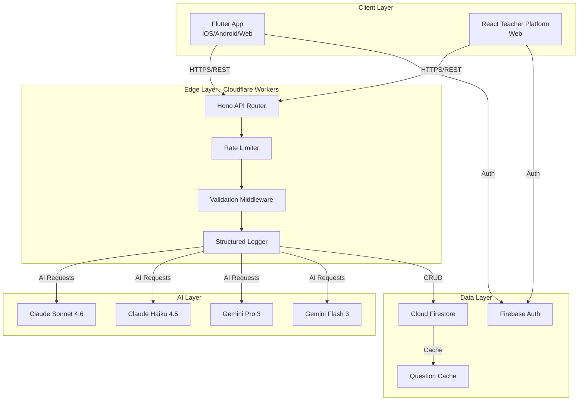
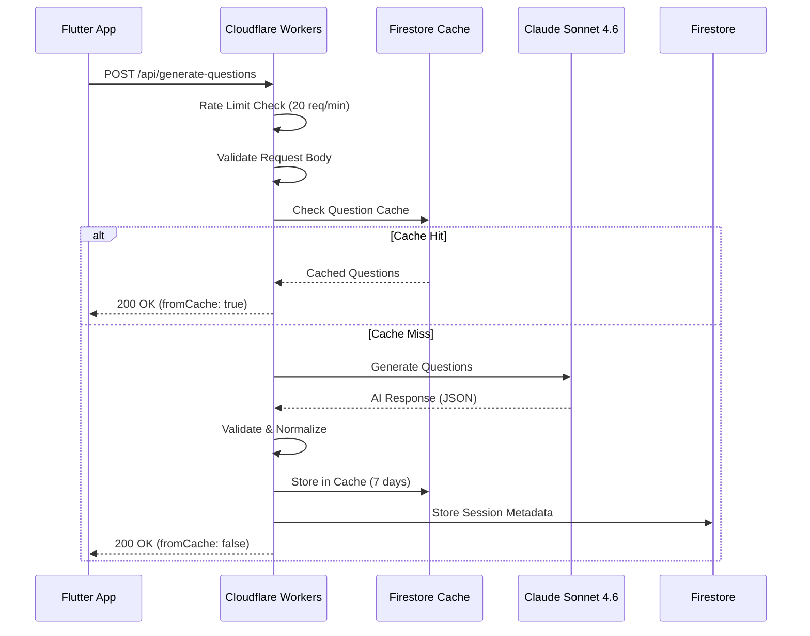
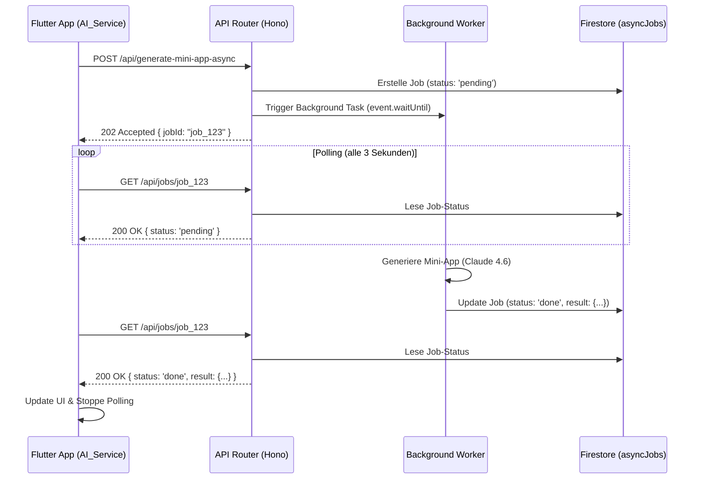
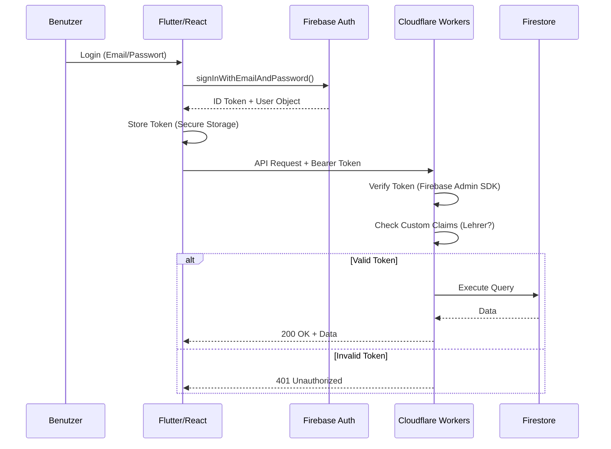
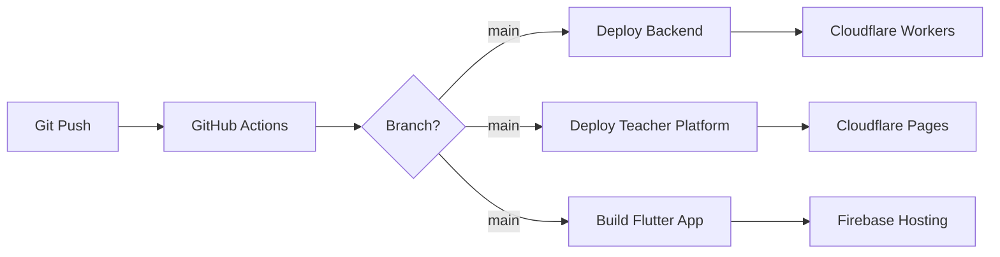

# Systemarchitektur

## Überblick

SLaM folgt einer modernen **3-Tier-Architektur** mit strikter Trennung von Präsentations-, Geschäftslogik- und Datenschicht. Das System ist für hohe Skalierbarkeit, niedrige Latenz und maximale Verfügbarkeit optimiert.

## Architekturdiagramm



## Schichtenmodell

### 1. Client Layer (Präsentationsschicht)

**Flutter App (Schüler)**
- **Architektur**: Clean Architecture mit Feature-First-Organisation
- **State Management**: Riverpod 2.6+ (Provider-basiert, reaktiv)
- **Offline-First**: 4-Layer-Caching (Memory → SharedPreferences → Hive → Firestore)
- **Plattformen**: iOS, Android, Web (Single Codebase)

**React Teacher Platform (Lehrkräfte)**
- **Architektur**: Feature-basierte Modulstruktur
- **State Management**: Zustand (Client State) + TanStack Query (Server State)
- **Code Splitting**: Route-basiertes Lazy Loading
- **Bundle Size**: 55 KB initial (90% Reduktion durch Vendor Chunks)

### 2. Edge Layer (Geschäftslogik)

**Cloudflare Workers**
- **Runtime**: V8 Isolates (< 5ms Cold Start)
- **Framework**: Hono (TypeScript, Zero-Dependency Router)
- **Deployment**: Global Edge Network (300+ Standorte)
- **Skalierung**: Automatisch, unbegrenzt

**Middleware-Pipeline**:
```
Request → CORS → Rate Limiter → Validator → Logger → Handler → Response
```

### 3. AI Layer (KI-Orchestrierung)

**Multi-Provider-Strategie**
SLaM nutzt ein dynamisches Multi-Provider-Setup (Anthropic, Google Gemini, Mistral, OpenAI, OpenRouter), das über die `models.json` zentral im Backend orchestriert wird (`callAI.ts`).
- **Task-basierte Modellauswahl**: Jede API-Operation nutzt das optimale Modell (z. B. Claude Sonnet 4.6 für Didaktik, Gemini 3.2 Flash für Echtzeit-Bewertungen).
- **Fallback-Mechanismen**: Automatischer Wechsel bei Modell-Ausfall (`allowFallbackOnError`), standardmäßig auf `gemini-3.2-flash`.
- **Zentrale Konfiguration**: `models.json` erlaubt Modellwechsel ohne Code-Deployments.

**Strategische Modell-Aufteilung**:

| Task | Provider / Modell | Begründung |
|------|--------|------------|
| `generateQuestions` | Anthropic / Claude Sonnet 4.6 | Höchste Qualität für komplexe didaktische Fragen und Code-Generierung. |
| `evaluateAnswer` | Google / Gemini 3.2 Flash | Extrem niedrige Latenz für echtzeitnahe Evaluationen. |
| `customHint` | Google / Gemini 3.2 Flash | Schnelle Generierung progressiver, sanfter Hinweise. |
| `generateGeogebra` | Mistral / Mistral Medium 3.5 | Spezifische Eignung für strikte GeoGebra-Scripting-Syntax. |
| `aiAssessment` | Anthropic / Claude Sonnet 4.6 | Generierung tiefgründiger XAI (Explainable AI) JSON-Auswertungen für Lehrkräfte. |

### 4. Data Layer (Persistenz)

**Cloud Firestore**
- **Struktur**: Dokumentenbasiert, hierarchisch
- **Indizierung**: Composite Indexes für komplexe Queries
- **Security Rules**: Strikte Zugriffskontrolle
- **Caching**: 7-Tage-Cache für generierte Fragen

**Firebase Auth**
- **Provider**: E-Mail/Passwort
- **Domain-Restriktion**: Nur @mvl-gym.de
- **Custom Claims**: Lehrer-Rolle für Plattformzugriff

## Datenfluss

### Fragengenerierung (Kritischer Pfad)



**Performance-Optimierungen**:
1. **Cache-First**: 7-Tage-Cache reduziert AI-Calls um ~80%
2. **Edge Computing**: < 50ms Latenz durch globale Verteilung
3. **Batch Processing**: Bis zu 20 Fragen pro Request
4. **Lazy Loading**: Fragen werden im Hintergrund nachgeladen

### HTTP 202 Async-Polling Pattern (Background Jobs)

Für langlaufende KI-Operationen (z. B. Generierung von interaktiven HTML/JS Mini-Apps oder GeoGebra Applets), bei denen die Ausführungszeit das Timeout des Clients oder der Edge-Plattform überschreiten könnte, wird ein asynchrones Polling-Muster verwendet.



**Vorteile der Architektur:**
- **Non-blocking UI**: Die Flutter-App (mittels `generateMiniAppWithPolling` in `ai_service.dart`) friert nicht ein und kann den Status an den Nutzer melden.
- **Sicherheit**: Die Collection `/asyncJobs/{jobId}` ist per `firestore.rules` für den direkten Client-Lesezugriff gesperrt (`allow read, write: if false;`). Nur das Backend darf Jobs aktualisieren und auslesen.

### Authentifizierung & Autorisierung



## Separation of Concerns

### Backend (Cloudflare Workers)

**Ordnerstruktur**:
```
src/
├── api/              # Endpoint-Handler
│   ├── generate-questions.ts
│   ├── evaluate-answer.ts
│   └── custom-hint.ts
├── teacher/          # Lehrerplattform-Routen
│   ├── classes.ts
│   ├── analytics.ts
│   └── students.ts
├── utils/            # Shared Utilities
│   ├── validation.ts    # Composable Validation
│   ├── rateLimit.ts     # Rate Limiting
│   ├── logger.ts        # Structured Logging
│   └── callAI.ts        # AI-Orchestrierung
└── index.ts          # Hono App + Middleware
```

**Prinzipien**:
- **Single Responsibility**: Jede Datei hat genau eine Aufgabe
- **Dependency Injection**: Services über Hono Context
- **Type Safety**: Strikte TypeScript-Typen, keine `any`

### Flutter App

**Clean Architecture**:
```
lib/
├── core/             # Shared Infrastructure
│   ├── models/       # Domain Models (Freezed)
│   ├── services/     # Business Logic
│   └── utils/        # Helpers
├── features/         # Feature Modules
│   ├── auth/
│   │   ├── data/           # Repositories
│   │   ├── domain/         # Entities
│   │   └── presentation/   # UI + Providers
│   ├── live_feed/
│   └── gamification/
└── app/              # App-Level Config
```

**Prinzipien**:
- **Feature-First**: Jedes Feature ist isoliert
- **Unidirectional Data Flow**: State → UI (reaktiv)
- **Immutability**: Freezed Models, keine Mutation

### React Teacher Platform

**Feature-basierte Struktur**:
```
src/
├── api/              # API Client + Hooks
├── components/       # Shared Components
├── pages/            # Route Components (Lazy Loaded)
├── store/            # Zustand Stores
└── firebase.ts       # Firebase Config
```

**Prinzipien**:
- **Colocation**: Code nah an Verwendung
- **Lazy Loading**: Jede Route ist ein eigener Chunk
- **Server State Separation**: TanStack Query für API-Daten

## Skalierbarkeit

### Horizontale Skalierung

**Cloudflare Workers**:
- **Automatisch**: Keine Konfiguration nötig
- **Global**: Requests werden am nächsten Edge-Standort bearbeitet
- **Unbegrenzt**: Keine Obergrenze für Requests/Sekunde

**Firestore**:
- **Automatisch**: Sharding bei hoher Last
- **Multi-Region**: Daten repliziert über mehrere Regionen
- **Limitierungen**: 1 Mio. Concurrent Connections

### Vertikale Skalierung

**Rate Limiting**:
- **AI-Endpoints**: 20 req/min pro IP
- **Standard-Endpoints**: 60 req/min pro IP
- **Generous-Endpoints**: 300 req/min pro IP

**Caching**:
- **Question Cache**: 7 Tage (Firestore)
- **App Cache**: 4-Layer (Memory → Disk → Cloud)
- **CDN**: Statische Assets (Cloudflare)

## Fehlerbehandlung

### Backend

**Strukturierte Fehler**:
```typescript
{
  "success": false,
  "error": "Validation Error",
  "message": "email must be a valid email",
  "field": "email"
}
```

**HTTP Status Codes**:
- `400`: Validation Error
- `401`: Unauthorized
- `429`: Rate Limit Exceeded
- `500`: Internal Server Error

### Frontend

**Flutter Error Handling**:
```dart
try {
  final result = await aiService.generateQuestions(...);
} on AIException catch (e) {
  if (e.statusCode == 429) {
    // Rate limit → Retry mit Backoff
  } else {
    // Generischer Fehler → User-Feedback
  }
}
```

**React Error Boundaries**:
- Komponentenbasierte Fehlerbehandlung
- Fallback-UI bei Crashes
- Automatisches Error-Reporting

## Monitoring & Observability

### Structured Logging

**Backend (JSON)**:
```json
{
  "timestamp": "2026-04-27T10:30:45.123Z",
  "level": "INFO",
  "message": "[generate-questions] Request received",
  "context": {
    "userId": "abc123",
    "questionCount": 20,
    "topicCount": 3
  }
}
```

**Flutter (Tagged)**:
```
[10:30:45] ℹ️ [Auth] INFO: User logged in
  Data: {userId: abc123, email: user@mvl-gym.de}
```

### Metriken

**Backend**:
- Request Count (pro Endpoint)
- Response Time (P50, P95, P99)
- Error Rate (4xx, 5xx)
- Rate Limit Hits

**Frontend**:
- App Crashes
- API Error Rate
- Screen Load Time
- User Engagement (XP, Streaks)

## Sicherheit

### Defense in Depth

**Layer 1: Network**
- CORS Whitelist
- HTTPS-Only
- Cloudflare DDoS Protection

**Layer 2: Application**
- Rate Limiting (IP-basiert)
- Input Validation (Schema-basiert)
- JWT Token Verification

**Layer 3: Data**
- Firestore Security Rules
- Firebase Auth Domain Restriction
- Encrypted at Rest (Firestore)

### Threat Model

| Bedrohung | Mitigation |
|-----------|------------|
| DDoS | Cloudflare Protection + Rate Limiting |
| SQL Injection | NoSQL (Firestore) + Input Validation |
| XSS | React Auto-Escaping + CSP Headers |
| CSRF | SameSite Cookies + Token-basierte Auth |
| Brute Force | Rate Limiting (5 req/min für Auth) |

## Deployment-Pipeline



**Automatisierung**:
- **Backend**: Push zu `main` → Auto-Deploy in ~30s
- **Teacher**: Push zu `main` → Auto-Deploy in ~2min
- **App**: Manueller Build + Upload zu Stores

## Nächste Schritte

- [Backend Details](backend.md) – Cloudflare Workers Implementierung
- [Flutter App Details](app.md) – Mobile/Web Frontend
- [Teacher Platform Details](teacher.md) – React Dashboard
